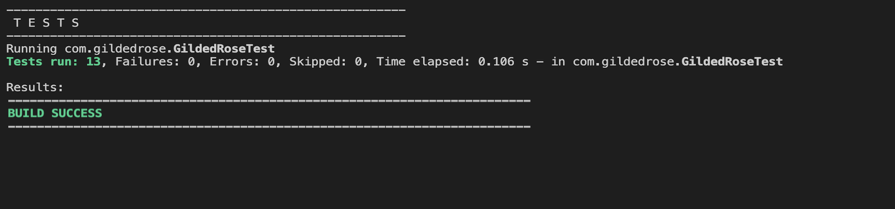

## Gilded Rose Requirements Specification 🛎🌹

Participants:  
**Manasse Nkundimana**  
**Luciano Crossa Niell**

---

### Unit Tests

## 

### Code Coverage

## 

---

We used Google Chat for face to face communication via video and screenshare. Because we needed a subscription, we recorded the screenshare using BandiCam software and then uploaded the videos to Teams to then share them through the below links.

---

**1st Session Recording**- Unit Test Meeting  
**2nd Session Recording**- Code Refactor  
[View Video of sessions here](https://kennesawedu.sharepoint.com/sites/Team-ESEPTeam1/_layouts/15/stream.aspx?id=%2Fsites%2FTeam%2DESEPTeam1%2FShared%20Documents%2FGeneral%2Fbandicam%2D2023%2D07%2D06%2D15%2D31%2D16%2D745%5F97XSGJEV%2Emp4&ga=1)

---

## Task | Description | Status

Hi and welcome to team Gilded Rose. As you know, we are a small inn with a prime location in a
prominent city ran by a friendly innkeeper named Allison. We also buy and sell only the finest goods.
Unfortunately, our goods are constantly degrading in quality as they approach their sell by date. We
have a system in place that updates our inventory for us. It was developed by a no-nonsense type named
Leeroy, who has moved on to new adventures. Your task is to add the new feature to our system so that
